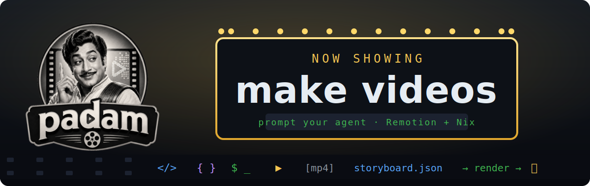

<div align="center">



# padam

**Prompt your agent to make videos.**
*`padam` (படம்) — Tamil for “movie / film / picture.”*

<video src="https://padam.srid.ca/videos/tutorial.mp4" poster="https://padam.srid.ca/og.png" controls muted width="720">
  <a href="https://padam.srid.ca/videos/tutorial/">▶ Watch the padam tutorial</a>
</video>

**[padam.srid.ca](https://padam.srid.ca)** · [browse the gallery](https://padam.srid.ca/videos/)

</div>

A video is a **`storyboard.json`** — an ordered list of scenes you (or your coding
agent) write in plain, hand-editable JSON. `padam` renders it to a deterministic MP4
with [Remotion](https://remotion.dev) + headless Chromium, Nix-pinned. You *direct*;
the agent *edits the storyboard and renders*; it can even look at the frames and
refine. Not just for one kind of content — explainers, changelogs, code walkthroughs,
release clips, social shorts, quote cards.

> **The source of truth is the storyboard, not the MP4.** A 5-line diff is a real
> edit, and anyone can re-render. Videos live in [`./videos/`](./videos) — this repo
> is its own library (we dogfood the tool here).

## Watch the tutorial

[`videos/tutorial/out.mp4`](./videos/tutorial/out.mp4) is itself a padam — a
60-second tutorial for padam, built from [its storyboard](./videos/tutorial/storyboard.json).

## Quick start

```bash
nix develop          # node + pnpm + Nix-pinned chromium + ffmpeg + fonts (zero flake inputs, via npins)
pnpm install
just render tutorial # renders on the pu box `padam` (never local), copies the MP4 back
just open tutorial

just new my-clip     # scaffold videos/my-clip/storyboard.json, then edit + render
```

> **Renders run on a pu box, never locally** — headless-Chromium rendering is expensive
> and NixOS-fiddly. `just render <name>` offloads to the pre-created pu host `padam`
> (override: `just render <name> <host>`). See [`.apm/instructions/rendering.md`](./.apm/instructions/rendering.md).

…or just tell your agent: *“make a 30-second clip announcing v2, dark, square for LinkedIn.”*

## A storyboard

```jsonc
{
  "title": "my first video",
  "width": 1920, "height": 1080, "fps": 30,
  "scenes": [
    { "kind": "title",  "durationInFrames": 90, "heading": "Hello, world!", "sub": "padam" },
    { "kind": "code",   "durationInFrames": 150, "lang": "ts", "code": "const x = 1", "caption": "…" },
    { "kind": "outro",  "durationInFrames": 90, "heading": "Bye", "chips": ["made with padam"] }
  ]
}
```

### Scene kinds

| kind | what it shows | main fields |
|---|---|---|
| `title` | title / section card | `heading`, `sub`, `eyebrow` |
| `bullets` | a list that reveals | `heading`, `items[]` |
| `code` | syntax-highlighted block (Shiki) | `lang`, `code`, `file` |
| `diff` | red/green before→after | `lang`, `before`, `after`, `file` |
| `terminal` | a typed shell line | `command`, `output` |
| `quote` | a pull quote | `text`, `by` |
| `image` | a static image from the video folder | `src`, `caption` |
| `stats` | animated stat pills | `heading`, `chips[]` |
| `outro` | closing card | `heading`, `sub`, `chips[]` |
| `custom` | a bespoke `.tsx` scene (escape hatch) | `component`, `props` |

Every scene also takes `durationInFrames`, optional `caption` (on-screen) and
`narration` (for future TTS). Full reference: [`.apm/skills/video/reference/scenes.md`](./.apm/skills/video/reference/scenes.md).

## How you direct it

The loop, conversational:

1. **Describe** the video → the agent writes/edits `videos/<name>/storyboard.json`.
2. **Render** → `just render <name>` (or `npx tsx src/render.ts videos/<name>`).
3. **Look** → the agent extracts a frame per scene and *sees* its own output.
4. **Refine** → "scene 3 too fast, use brand blue, swap in the perf chart" → it edits JSON / theme / writes a custom scene → re-render.

Determinism (no `Date.now`/`Math.random`/network in frames; Shiki runs at build time) means *what it previews is what ships*.

## Customize

- **Content** — text, durations, order, captions: edit the JSON.
- **Look** — a `theme` block (colors + font stacks); aspect via `width`/`height`.
- **Assets** — drop images/logos in `videos/<name>/`, reference by filename.
- **Custom motion** — register a React scene in `src/scenes/custom/` and use `{"kind":"custom","component":"MyScene","props":{…}}`. Full Remotion when the catalog isn't enough.

## Reusable components

Two layers of reuse:

- **Built-in scene kinds** (the catalog above) ship with padam — reusable in every
  video and every repo that installs the skill.
- **Custom components** live in [`src/scenes/custom/`](./src/scenes/custom). Register a
  React scene there and any storyboard in the repo can use it:

  ```jsonc
  { "kind": "custom", "component": "ClaudePrompt", "durationInFrames": 175,
    "props": { "cwd": "~/code/site", "prompt": "make a 30s launch clip, dark, square",
               "response": "● writing videos/launch/storyboard.json …" } }
  ```

  The included [`ClaudePrompt`](./src/scenes/custom/ClaudePrompt.tsx) renders a Claude
  Code prompt (you'll see it in the tutorial). Build your own branded pieces the same
  way — they reuse padam's primitives (`Window`, `Cursor`, `typed`, `useTheme`) so they
  match the built-ins. To share across repos, ship the file with the skill or copy it.

## Install as an APM package

`padam`'s video skill is published for [APM](https://microsoft.github.io/apm/) — add it to any repo's `apm.yml`:

```yaml
dependencies:
  apm:
    - srid/padam
```

Then prompt your agent to make a video in *that* repo — the `video` skill ships via
the `includes:` allow-list (the Nix dev skills stay maintainer-only as
`devDependencies`). See [`.apm/skills/video/SKILL.md`](./.apm/skills/video/SKILL.md).

## Rendering (on a pu box, never local)

`just render <name>` runs [`scripts/remote-render.sh`](./scripts/remote-render.sh): it
syncs the source + the one video folder to the pu host `padam`, renders there inside
`nix shell` (Chromium/ffmpeg/fonts resolved through Nix, `$CHROMIUM_PATH` passed to
Remotion so it never downloads a browser), and copies the MP4 back. The render box
doesn't need [`nix-ld`](https://github.com/nix-community/nix-ld) — the prebuilt
compositor is wrapped to launch through the Nix loader
([`scripts/remote-build.sh`](./scripts/remote-build.sh) ·
[reference/nixos.md](./.apm/skills/video/reference/nixos.md)). Create the box once
(`pu create padam`-style); we deliberately never render locally.

## Layout

```
src/                the engine — schema · model · highlight · scenes · Video · Root · render
videos/<name>/      one folder per video: storyboard.json (+ assets, + out.mp4)
site/               Astro gallery → GitHub Pages (a page per video; `nix build .#site`)
.apm/skills/video/  the APM skill that ships to consumers (via `includes:`)
dev/                maintainer-only APM package — dev instructions (a devDependency)
assets/             padam-marquee.svg · padam-logo.png · og.png (Open Graph banner)
nix/ npins/         zero-inputs flake plumbing (nix-for-dev): nixpkgs pin, env, overlay
flake.nix · default.nix · nix/site.nix · shell.nix · justfile · apm.yml · .npmrc
```

## License

[AGPL-3.0-or-later](./LICENSE).
